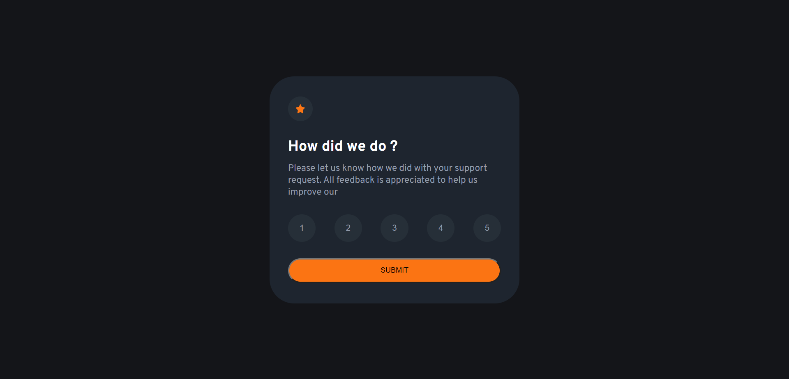
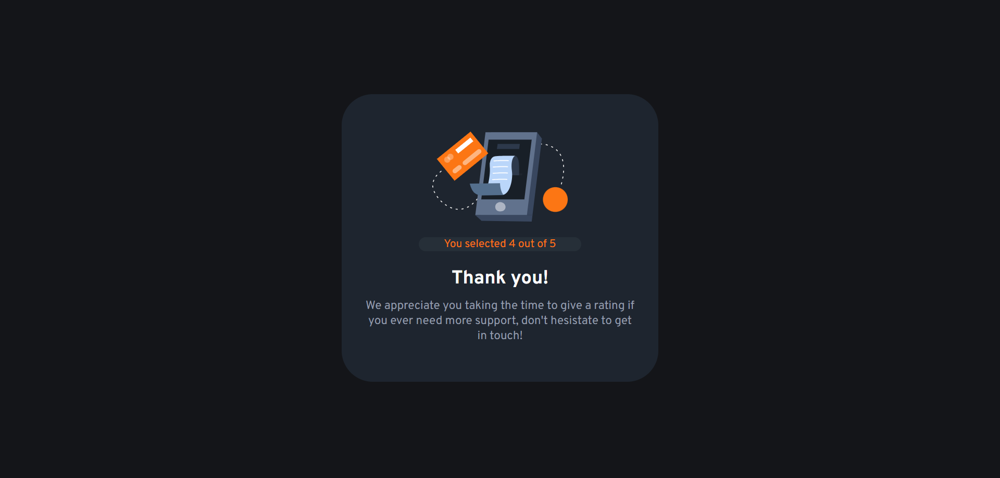

# Frontend Mentor - Interactive rating component solution

This is a solution to the [Interactive rating component challenge on Frontend Mentor](https://www.frontendmentor.io/challenges/interactive-rating-component-koxpeBUmI). Frontend Mentor challenges help you improve your coding skills by building realistic projects. 

## Table of contents

- [Overview](#overview)
  - [The challenge](#the-challenge)
  - [Screenshot](#screenshot)
  - [Links](#links)
- [My process](#my-process)
  - [Built with](#built-with)
  - [What I learned](#what-i-learned)
- [Author](#author)

**Note: Delete this note and update the table of contents based on what sections you keep.**

## Overview

### The challenge

Users should be able to:

- View the optimal layout for the app depending on their device's screen size
- See hover states for all interactive elements on the page
- Select and submit a number rating
- See the "Thank you" card state after submitting a rating

### Screenshot





### Links

- Solution URL: [https://github.com/MohamedBenArbi/Interactive-rating-component]
- Live Site URL: [https://mohamedbenarbi.github.io/Interactive-rating-component/]

## My process

### Built with

- Semantic HTML5 markup
- CSS custom properties
- Flexbox
- CSS Grid

### What I learned

The most usefull thing i learing while working on this component is how to style the last button clicked as well as saving the id of clicked button to use later on the next component

```js
function saveRating(id){
    
    for(let i = 1 ;i <= 5 ;i++){
        document.getElementById(i).style.backgroundColor = "#262f38" ; 
        document.getElementById(id).style.backgroundColor = "hsl(217, 12%, 63%)"
        document.getElementById(id).style.color = "white"

    }
     localStorage.setItem("Rating",id);
}
```


## Author

- Website - [MohamedBenArbi](https://www.your-site.com)
- Frontend Mentor - [@yourusername](https://www.frontendmentor.io/profile/MohamedBenArbi)
- Twitter - [@Arbiii01](https://twitter.com/Arbiii01)
